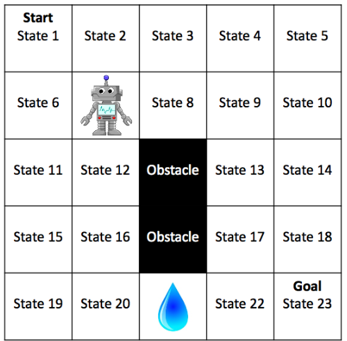

# Value Iteration on a simple grid

• **<u>State</u>**: Position of Robot.
The robot does not have a direction that it is facing (go in any
direction)

• **<u>Actions</u>**: AU (attempt_up), AD, AL, and AR

• **<u>Environment Dynamics</u>**:
– With probability of 0.8 the robot moves in a
specified direction.
– With p = 0.05 it gets confused and veers to the
right i.e. + 900 from where it attempted to
move (i.e. AU results in AR or AL, etc.)
– With p = 0.05 it gets confused and veers to the
left i.e. - 900 from where it attempted to move
– With p = 0.1 the robot temporarily breaks and
does not move at all
– If dynamics would cause the agent to EXIT or
hit OBSTACLE then the agent does not move
– Start in STATE = 1 and the process ends
when STATE = 23

• **<u>Rewards</u>**:
– Receives -10 if enters in the WATER state. Receives additional -10 if stays
in the same sate (hitting the wall, etc.)
– Receives +10 if enters in the GOAL state 23
– Entering any other state results in reward = 0
#

## Task 1
Let us have the agent uniformly randomly select actions. I have run 10,000 episodes and reported
the mean, standard deviation, maximum, and minimum of the observed
discounted returns.

    Task 1 Results: 
    Mean: -0.6063058120673711
    Standard Deviation: 2.295495381218213
    Maximum: 4.304672100000001
    Minimum: -47.01162157647506

## Task 2
I have implemented the value iteration algorithm to find the optimal policy. In this
case, the agent will select actions that will provide maximum future discounted
rewards. I have report the optimal policy.

    Optimal Policy:
    AD	AD	AD	AD	AU	
    AR	AR	AR	AD	AD	
    AU	AU	AU	AD	AD	
    AU	AR	AU	AD	AD	
    AU	AU	AR	AR	-

    Following optimal policy to reach the goal state:
    Starting at: (0, 0)
    Action: AD | Next state: (0, 0) | Reward: 0.0 | Total Reward: 0.0
    Action: AD | Next state: (1, 0) | Reward: 0.0 | Total Reward: 0.0
    Action: AR | Next state: (1, 1) | Reward: 0.0 | Total Reward: 0.0
    Action: AR | Next state: (1, 2) | Reward: 0.0 | Total Reward: 0.0
    Action: AR | Next state: (1, 3) | Reward: 0.0 | Total Reward: 0.0
    Action: AD | Next state: (2, 3) | Reward: 0.0 | Total Reward: 0.0
    Action: AD | Next state: (3, 3) | Reward: 0.0 | Total Reward: 0.0
    Action: AD | Next state: (3, 4) | Reward: 0.0 | Total Reward: 0.0
    Action: AD | Next state: (4, 4) | Reward: 10.0 | Total Reward: 10.0
    Reached the goal state with a total reward of: 10.0

## Task 3
I have run the optimal policy that I found in Task 2 for 10,000 iterations. Further, I have compared the mean,
standard deviation, maximum, and minimum of the observed discounted
returns with Task 1.

    Task 3 Results:
    Mean: 3.921796074201619
    Standard Deviation: 0.712729491061633
    Maximum: 4.7829690000000005
    Minimum: 0.033813919135227306

Comparing the results of Task 1 and Task 3 provides insights into the performance improvement achieved by using the optimal policy obtained through value iteration.
1.	Mean Reward:
•	Task 1: The mean discounted return obtained by the agent following a uniform random policy is approximately -0.61. This means that, on average, the agent performs poorly, with a negative reward per episode.
•	Task 3: In contrast, the mean discounted return obtained by following the optimal policy is significantly higher at approximately 3.92. This suggests a substantial improvement in performance, with the agent achieving a much higher average reward per episode.
2.	Standard Deviation:
•	Task 1: The standard deviation of the discounted returns in Task 1 is approximately 2.30. This indicates a high variability in performance across episodes, with a wide spread of rewards.
•	Task 3: Conversely, the standard deviation of the discounted returns in Task 3 is much lower at approximately 0.71. This suggests that the performance of the agent following the optimal policy is more consistent across episodes, with less variability in rewards.
3.	Maximum Reward:
•	Task 1: The highest discounted return achieved in Task 1 is approximately 4.30, indicating that the agent occasionally performs well under the random policy.
•	Task 3: The maximum discounted return obtained in Task 3 is slightly higher at approximately 4.78. While this improvement may seem marginal, it reflects the agent's ability to consistently achieve higher rewards with the optimal policy.
4.	Minimum Reward:
•	Task 1: The lowest discounted return observed in Task 1 is approximately -47.01, indicating episodes where the agent performs exceptionally poorly due to encountering obstacles or negative rewards.
•	Task 3: In contrast, the minimum discounted return in Task 3 is much higher at approximately 0.03. This suggests that even in the worst-case scenarios, the agent following the optimal policy still receives some positive reward, likely due to more informed decision-making.

